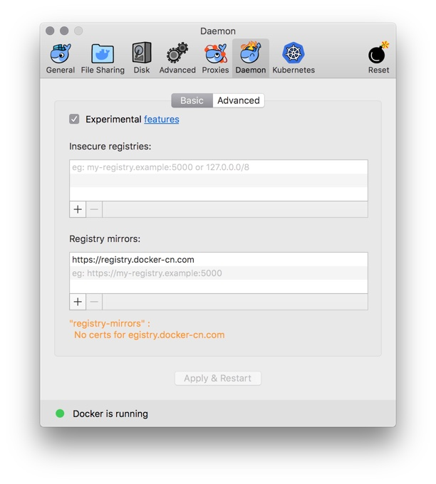
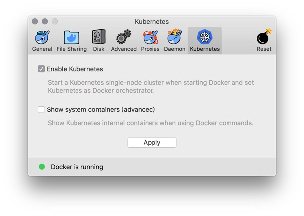

# Enable Kubernetes on Docker for Mac/Windows in China

NOTE: 

* The master branch is tested with Docker for Mac/Windows 18.09/18.06 (with Kubernetes 1.10.3). If you want to use 18.03, please use the 18.03 branch ```git checkout 18.03```

### Enable Kubernetes on Docker for Mac

Config registry mirror for Docker daemon with ```https://registry.docker-cn.com```



Preload Kubernetes images form Alibaba Cloud Registry Service, NOTE: you can modify the ```images.properties``` for your own images

```
./load_images.sh
```

Enable Kubernetes in Docker for Mac, and wait a while for Kubernetes is running





### Enable Kubernetes on Docker for Windows

Config registry mirror for Docker daemon with ```https://registry.docker-cn.com```


Optional: config the CPU and memory for Kubernetes, 4GB RAM or more is suggested. 


Preload Kubernetes images form Alibaba Cloud Registry Service, NOTE: you can modify the ```images.properties``` for your own images

In Bash shell

```
./load_images.sh
```

or in PowerShell of Windows

```
 .\load_images.ps1
```

NOTE: if you failed to start PowerShell scripts for security policy, please execute ```Set-ExecutionPolicy RemoteSigned``` command in PowerShell with "Run as administrator" option. 

Enable Kubernetes in Docker for Windows, and wait a while for Kubernetes is running


### Config Kubernetes


Optional: switch the context to docker-for-desktop

```
kubectl config use-context docker-for-desktop
```

Verify Kubernetes installation

```
kubectl cluster-info
kubectl get nodes
```

Deploy Kubernetes dashboard


```
kubectl create -f https://raw.githubusercontent.com/kubernetes/dashboard/master/src/deploy/recommended/kubernetes-dashboard.yaml
```

or

```
kubectl create -f kubernetes-dashboard.yaml
```

Start proxy for API server

```
kubectl proxy
```

Access dashboard

```
http://localhost:8001/api/v1/namespaces/kube-system/services/https:kubernetes-dashboard:/proxy/#!/overview?namespace=default
```

### Install Helm

Install helm client following the instruction on https://github.com/helm/helm/blob/master/docs/install.md

```
# Use homebrew on Mac
brew install kubernetes-helm

# Install Tiller into your Kubernetes cluster
helm init --upgrade -i registry.cn-hangzhou.aliyuncs.com/google_containers/tiller:v2.9.1

# update charts repo
helm repo update
```

### Install Istio

More details can be found in https://istio.io/docs/setup/kubernetes/

Download Istio 1.0.0 and install CLI

```
curl -L https://git.io/getLatestIstio | sh -
cd istio-1.0.0/
export PATH=$PWD/bin:$PATH
```

Install Istio with Helm chart

```
kubectl apply -f install/kubernetes/helm/istio/templates/crds.yaml
helm install install/kubernetes/helm/istio --name istio --namespace istio-system
helm status istio
```

Enable automatic sidecar injection for ```default``` namespace

```
kubectl label namespace default istio-injection=enabled
kubectl get namespace -L istio-injection
```

Install Book Info sample

```
kubectl apply -f samples/bookinfo/platform/kube/bookinfo.yaml

# confirm application is running
export GATEWAY_URL=localhost:80
curl -o /dev/null -s -w "%{http_code}\n" http://${GATEWAY_URL}/productpage
```

Delete Istio

```
helm del --purge istio
```


