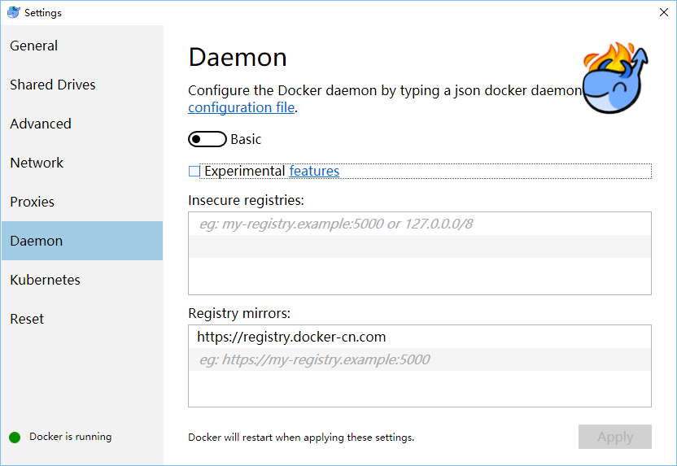
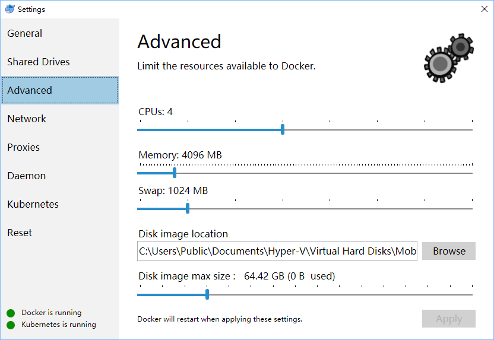
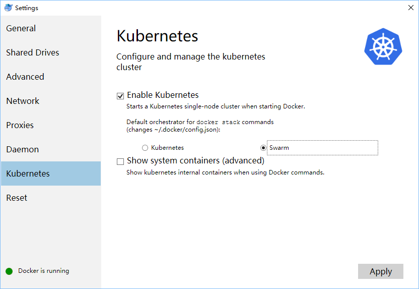

# Docker Desktop for Mac/Windows 开启 Kubernetes

中文 | [English](README_en.md)

说明: 

* 需安装 Docker Desktop 的 Mac 或者 Windows 版本，如果没有请下载[下载 Docker CE最新版本](https://store.docker.com/search?type=edition&offering=community)
* 当前 master 分支已经在 Docker for Mac/Windows 2.0.5.x (包含 Docker CE 19.03.0 和 Kubernetes 1.14.3) 版本测试通过
  * 如果你希望使用 Docker for Mac/Windows 2.0.4.x (包含 Docker CE 18.09.1 和 Kubernetes 1.14.1) , 请使用下面命令切换 [v1.14.1 分支](https://github.com/AliyunContainerService/k8s-for-docker-desktop/tree/v1.14.1) ```git checkout v1.14.1```
  * 如果你希望使用 Docker for Mac/Windows 2.0.1.x/2.0.2.x/2.0.3.x (包含 Docker CE 18.09.1 和 Kubernetes 1.13.0) , 请使用下面命令切换 [v2.0.1.0 分支](https://github.com/AliyunContainerService/k8s-for-docker-desktop/tree/v2.0.1.0) ```git checkout v2.0.1.0```
  * 如果你希望使用 Docker for Mac/Windows 2.0.0.2/2.0.0.3 (包含 Docker CE 18.09.1 和 Kubernetes 1.10.11) , 请使用下面命令切换 [v2.0.0.2 分支](https://github.com/AliyunContainerService/k8s-for-docker-desktop/tree/v2.0.0.2) ```git checkout v2.0.0.2```
  * 如果你希望使用 18.09/18.06 版本(包含 Kubernetes 1.10.3) , 请使用下面命令切换 [18.09 分支](https://github.com/AliyunContainerService/k8s-for-docker-desktop/tree/18.09) ```git checkout 18.09```
  * 如果你希望使用 18.03 版本, 请使用下面命令切换 [18.03 分支](https://github.com/AliyunContainerService/k8s-for-docker-desktop/tree/18.03) ```git checkout 18.03```


查看 Docker Desktop版本，Docker -> About  Docker Desktop


### Docker Desktop for Mac 开启 Kubernetes

为 Docker daemon 配置镜像加速，参考[阿里云镜像服务](https://cr.console.aliyun.com/cn-hangzhou/instances/mirrors) 或中科大镜像加速地址```https://docker.mirrors.ustc.edu.cn```


可选操作: 为 Kubernetes 配置 CPU 和 内存资源，建议分配 4GB 或更多内存。 


预先从阿里云Docker镜像服务下载 Kubernetes 所需要的镜像, 可以通过修改 ```images.properties``` 文件加载你自己需要的镜像


```bash
./load_images.sh
```

开启 Kubernetes，并等待 Kubernetes 开始运行


**TIPS**：如果在Kubernetes部署的过程中出现问题，可以通过docker desktop应用日志获得实时日志信息：

```bash
pred='process matches ".*(ocker|vpnkit).*"
  || (process in {"taskgated-helper", "launchservicesd", "kernel"} && eventMessage contains[c] "docker")'
/usr/bin/log stream --style syslog --level=debug --color=always --predicate "$pred"
```

### Docker Desktop for Windows 开启 Kubernetes

为 Docker daemon 配置镜像加速，参考[阿里云镜像服务](https://cr.console.aliyun.com/cn-hangzhou/instances/mirrors) 或使用中科大镜像加速地址 ```https://docker.mirrors.ustc.edu.cn```



可选操作: 为 Kubernetes 配置 CPU 和 内存资源，建议分配 4GB 或更多内存。



预先从阿里云Docker镜像服务下载 Kubernetes 所需要的镜像, 可以通过修改 ```images.properties``` 文件加载你自己需要的镜像

使用 Bash shell

```bash
./load_images.sh
```

使用 PowerShell

```powershell
 .\load_images.ps1
```

说明: 如果因为安全策略无法执行 PowerShell 脚本，请在 “以管理员身份运行” 的 PowerShell 中执行 ```Set-ExecutionPolicy RemoteSigned``` 命令。 

开启 Kubernetes，并等待 Kubernetes 开始运行



**TIPS**：

* 如果在Kubernetes部署的过程中出现问题，可以在 C:\ProgramData\DockerDesktop下的service.txt 查看Docker日志
* 如果看到 Kubernetes一直在启动状态，请参考 [Issue 3769(comment)](https://github.com/docker/for-win/issues/3769#issuecomment-486046718) 和 [Issue 1962(comment)](https://github.com/docker/for-win/issues/1962#issuecomment-431091114)


### 配置 Kubernetes


可选操作: 切换Kubernetes运行上下文至 docker-for-desktop (docker-ce 18.09 下 context 为 docker-desktop)


```shell
kubectl config use-context docker-for-desktop
```

验证 Kubernetes 集群状态

```shell
kubectl cluster-info
kubectl get nodes
```

部署 Kubernetes dashboard

```shell
kubectl apply -f https://raw.githubusercontent.com/kubernetes/dashboard/v1.10.1/src/deploy/recommended/kubernetes-dashboard.yaml
```

或

```shell
kubectl create -f kubernetes-dashboard.yaml
```

开启 API Server 访问代理

```shell
kubectl proxy
```

通过如下 URL 访问 Kubernetes dashboard

http://localhost:8001/api/v1/namespaces/kube-system/services/https:kubernetes-dashboard:/proxy/#!/overview?namespace=default

### 配置 kubeconfig (可跳过)


对于Mac环境

```shell
TOKEN=$(kubectl -n kube-system describe secret default| awk '$1=="token:"{print $2}')
kubectl config set-credentials docker-for-desktop --token="${TOKEN}"
```

对于Windows环境

```shell
$TOKEN=((kubectl -n kube-system describe secret default | Select-String "token:") -split " +")[1]
kubectl config set-credentials docker-for-desktop --token="${TOKEN}"
```

#### 登录dashboard的时候选择 kubeconfig 文件


选择 kubeconfig 文件,路径如下：

```
Mac: $HOME/.kube/config
Win: %UserProfile%\.kube\config
```

点击登陆，进入Kubernetes Dashboard

### 配置 Ingress

说明：如果测试 Istio，不需要安装 Ingress

#### 安装 Ingress

```shell
kubectl apply -f https://raw.githubusercontent.com/kubernetes/ingress-nginx/master/deploy/static/mandatory.yaml
kubectl apply -f https://raw.githubusercontent.com/kubernetes/ingress-nginx/master/deploy/provider/cloud-generic.yaml
```

验证

```shell
kubectl get pods --all-namespaces -l app.kubernetes.io/name=ingress-nginx
```

#### 测试示例应用


部署测试应用，详情参见[社区文章](https://matthewpalmer.net/kubernetes-app-developer/articles/kubernetes-ingress-guide-nginx-example.html)


```shell
kubectl create -f sample/apple.yaml
kubectl create -f sample/banana.yaml
kubectl create -f sample/ingress.yaml
```

测试示例应用

```bash
$ curl -kL http://localhost/apple
apple
$ curl -kL http://localhost/banana
banana
```

删除示例应用

```shell
kubectl delete -f sample/apple.yaml
kubectl delete -f sample/banana.yaml
kubectl delete -f sample/ingress.yaml
```

#### 删除 Ingress

```shell
kubectl delete -f https://raw.githubusercontent.com/kubernetes/ingress-nginx/master/deploy/provider/cloud-generic.yaml
kubectl delete -f https://raw.githubusercontent.com/kubernetes/ingress-nginx/master/deploy/static/mandatory.yaml
```

### 安装 Helm

可以根据文档安装 helm https://github.com/helm/helm/blob/master/docs/install.md

#### 在 Mac OS 上安装

##### 通过 brew 安装

brew 安装的版本可能会和 helm server 不兼容, 如果在后续使用 helm 安装组件的过程中出现以下错误，可以 `通过二进制包安装` 对应的版本

```
$ helm install install/kubernetes/helm/istio-init --name istio-init --namespace istio-system
Error: incompatible versions client[v2.13.1] server[v2.12.2]
```

```shell
# Use homebrew on Mac
brew install kubernetes-helm

# Install Tiller into your Kubernetes cluster
helm init --upgrade -i registry.cn-hangzhou.aliyuncs.com/google_containers/tiller:v2.14.1 --skip-refresh

# Change helm repo
helm repo add stable http://mirror.azure.cn/kubernetes/charts-incubator/

# Update charts repo (Optional)
helm repo update
```

##### 通过二进制包安装

```
# Download binary release
在 https://github.com/helm/helm/releases 中找到匹配的版本并下载(需要梯子), 如: https://storage.googleapis.com/kubernetes-helm/helm-v2.14.1-darwin-amd64.tar.gz

# Unpack

tar -zxvf helm-v2.0.0-linux-amd64.tgz

# Move it to its desired destination

mv darwin-amd64/helm /usr/local/bin/helm

```

#### 在Windows上安装

如果在后续使用 helm 安装组件的过程中出现版本兼容问题，可以参考 `通过二进制包安装` 思路安装匹配的版本

```shell
# Use Chocolatey on Windows
# 注：安装的时候需要保证网络能够访问googleapis这个域名
choco install kubernetes-helm

# Install Tiller into your Kubernetes cluster
helm init --upgrade -i registry.cn-hangzhou.aliyuncs.com/google_containers/tiller:v2.14.1 --skip-refresh

# Change helm repo
helm repo add stable http://mirror.azure.cn/kubernetes/charts-incubator/

# Update charts repo (Optional)
helm repo update
```


### 配置 Istio

说明：Istio Ingress Gateway和Ingress缺省的端口冲突，请移除Ingress并进行下面测试

可以根据文档安装 Istio https://istio.io/docs/setup/kubernetes/

#### 下载 Istio 1.1.1 并安装 CLI

```bash
curl -L https://git.io/getLatestIstio | ISTIO_VERSION=1.2.2 sh -
cd istio-1.2.2/
export PATH=$PWD/bin:$PATH
```

在Windows上，您可以手工下载Istio安装包，或者把```getLatestIstio.ps1```拷贝到你希望下载 Istio 的目录，并执行 - 说明：根据社区提供的[安装脚本](https://gist.github.com/kameshsampath/796060a806da15b39aa9569c8f8e6bcf)修改而来

```powershell
.\getLatestIstio.ps1
```


#### 通过 Helm chart 安装 Istio

```shell
# 安装 istio-init chart 安装所有的 Istio CRD
helm install install/kubernetes/helm/istio-init --name istio-init --namespace istio-system

# 验证下安装的 Istio CRD 个数, 应该安装23个CRD
kubectl get crds | grep 'istio.io\|certmanager.k8s.io' | wc -l

# 开始 istio chart 安装
helm install install/kubernetes/helm/istio --name istio --namespace istio-system
```

#### 查看 istio 发布状态

```shell
helm status istio
```

#### 为 ```default``` 名空间开启自动 sidecar 注入

```shell
kubectl label namespace default istio-injection=enabled
kubectl get namespace -L istio-injection
```

#### 安装 Book Info 示例

```shell
kubectl apply -f samples/bookinfo/platform/kube/bookinfo.yaml
kubectl apply -f samples/bookinfo/networking/bookinfo-gateway.yaml
```


确认示例应用在运行中

```bash
export GATEWAY_URL=localhost:80
curl -o /dev/null -s -w "%{http_code}\n" http://${GATEWAY_URL}/productpage
```

可以通过浏览器访问

http://localhost/productpage


说明：如果当前80端口已经被占用或保留，我们可以编辑 ```install/kubernetes/helm/istio/values.yaml``` 文件中
Gateway 端口进行调整，比如将 80 端口替换为 8888 端口

```
      ## You can add custom gateway ports
    - port: 8888  # Changed from 80
      targetPort: 80
      name: http2
      nodePort: 31380
```

然后执行如下命令并生效

```shell
kubectl delete service istio-ingressgateway -n istio-system
helm upgrade istio install/kubernetes/helm/istio
```

#### 删除实例应用

```bash
samples/bookinfo/platform/kube/cleanup.sh
```

### 卸载 Istio

```shell
helm del --purge istio
kubectl delete -f install/kubernetes/helm/istio/templates/crds.yaml -n istio-system
```


