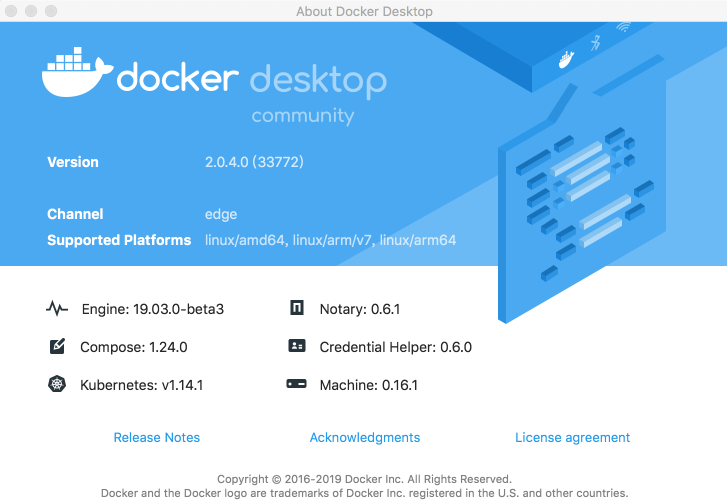
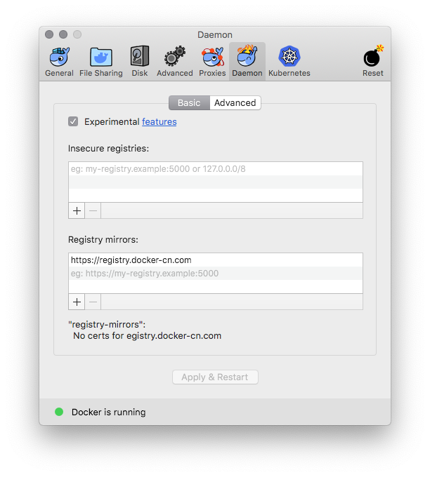
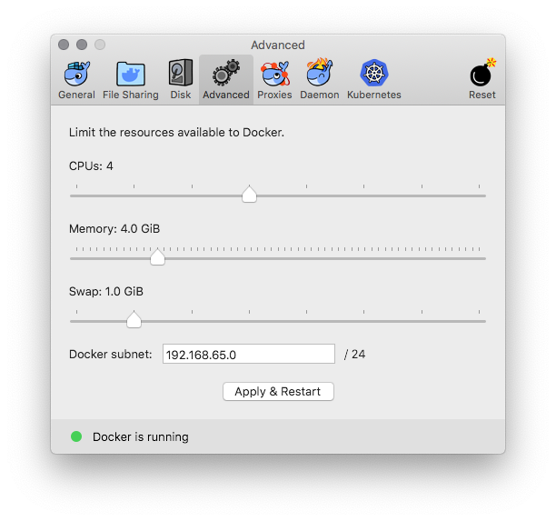
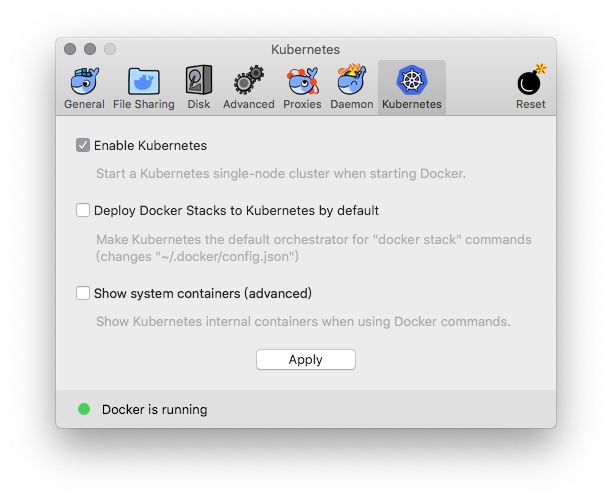
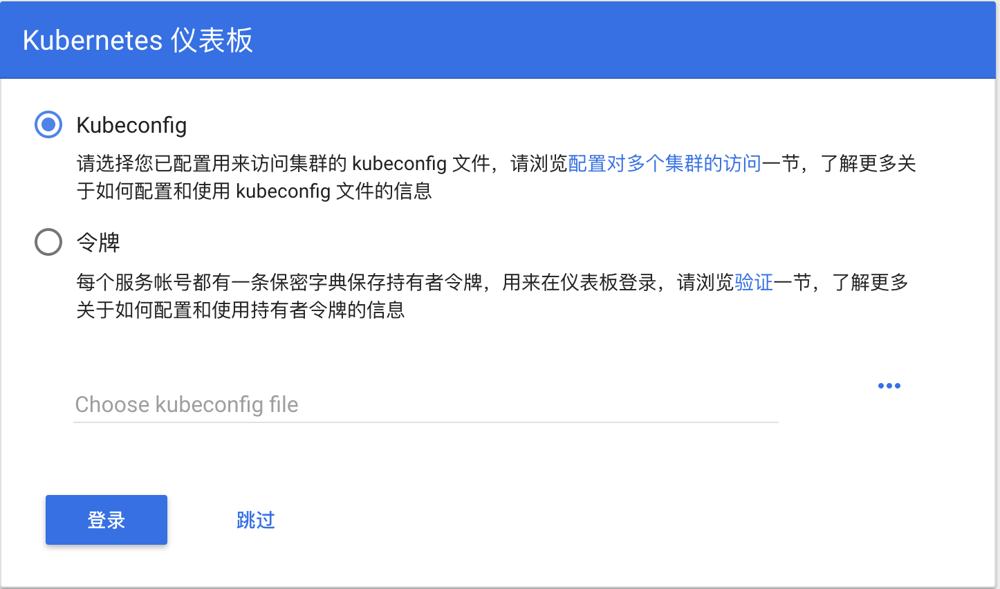

# Enable Kubernetes on Docker Desktop for Mac/Windows in China

[中文](README.md) | English

NOTE: 

* The master branch is tested with Docker Desktop for Mac/Windows version 2.1.5.0 Edge (with Docker CE 19.03.4 and Kubernetes 1.15.5). 
* If you want to use with other version, pls check version of Kubernetes，Docker -> About Docker Desktop
    
    * For Kubernetes v1.15.4, please use the v1.15.4 branch ```git checkout v1.15.4```
    * For Kubernetes v1.14.8, please use the v1.14.8 branch ```git checkout v1.14.8```
    * For Kubernetes v1.14.7, please use the v1.14.7 branch ```git checkout v1.14.7```
    * For Kubernetes v1.14.6, please use the v1.14.6 branch ```git checkout v1.14.6```
    * For Kubernetes v1.14.3, please use the v1.14.3 branch ```git checkout v1.14.3```
    * For Kubernetes v1.14.1, please use the v1.14.1 branch ```git checkout v1.14.1```
    * For Kubernetes v1.13.0, please use the v1.13.0 branch ```git checkout v1.13.0```
    * For Kubernetes v1.10.11, please use the v1.10.11 branch ```git checkout v1.10.11```


### Enable Kubernetes on Docker Desktop

Config registry mirror for Docker daemon with ```https://docker.mirrors.ustc.edu.cn``` only if in China



Optional: config the CPU and memory for Kubernetes, 4GB RAM or more is suggested. 



Preload Kubernetes images form Alibaba Cloud Registry Service, NOTE: you can modify the ```images.properties``` for your own images

On Mac, execute the following scripts

```bash
./load_images.sh
```

Or on Windows, execute the following scripts in PowerShell

```powershell
 .\load_images.ps1
```

NOTE: if you failed to start PowerShell scripts for security policy, please execute ```Set-ExecutionPolicy RemoteSigned``` command in PowerShell with "Run as administrator" option. 


Enable Kubernetes, and wait a while for Kubernetes is running




### Config Kubernetes


Optional: switch the context to `docker-desktop` (In the former version, the context is `docker-for-desktop`)


```shell
kubectl config use-context docker-desktop
```

Verify Kubernetes installation

```shell
kubectl cluster-info
kubectl get nodes
```


### Deploy Kubernetes dashboard

#### Install Kubernetes dashboard

```shell
kubectl apply -f https://raw.githubusercontent.com/kubernetes/dashboard/v1.10.1/src/deploy/recommended/kubernetes-dashboard.yaml
```

or

```shell
kubectl create -f kubernetes-dashboard.yaml
```

Start proxy for API server

```shell
kubectl proxy
```

#### Access Kubernetes dashboard

http://localhost:8001/api/v1/namespaces/kube-system/services/https:kubernetes-dashboard:/proxy/#!/overview?namespace=default

#### Config Token for dashboard

For Mac

```bash
TOKEN=$(kubectl -n kube-system describe secret default| awk '$1=="token:"{print $2}')
kubectl config set-credentials docker-for-desktop --token="${TOKEN}"
echo $TOKEN
```

For Windows

```cmd
$TOKEN=((kubectl -n kube-system describe secret default | Select-String "token:") -split " +")[1]
kubectl config set-credentials docker-for-desktop --token="${TOKEN}"
echo $TOKEN
```

#### Login dashboard



Choose **Token**, and input the output from above result

Or, choose **Kubeconfig**, select file from below path：

```
Win: %UserProfile%\.kube\config
Mac: $HOME/.kube/config
```

Click login, go to Kubernetes Dashboard

### Install Helm

Install helm following the instruction on https://helm.sh/docs/intro/install/

#### For Mac OS

```shell
# Use homebrew on Mac
brew install helm

# add helm repo
helm repo add stable http://mirror.azure.cn/kubernetes/charts/

# update charts repo
helm repo update
```

#### For Windows

```shell
# Use Chocolatey on Windows
# NOTE: please ensure you can access googleapis
choco install kubernetes-helm

# add helm repo
helm repo add stable http://mirror.azure.cn/kubernetes/charts/

# update charts repo
helm repo update
```

### Setup Istio

More details can be found in https://istio.io/docs/setup/getting-started/

#### Download Istio 1.4.0 and install CLI

```shell
curl -L https://git.io/getLatestIstio | ISTIO_VERSION=1.4.0 sh -
cd istio-1.4.0/
export PATH=$PWD/bin:$PATH
```

In Windows, you can download the Istio manually, or copy ```getLatestIstio.ps1``` to your Istio directory, and execute the script. 

NOTE: It refer the [scripts](https://gist.github.com/kameshsampath/796060a806da15b39aa9569c8f8e6bcf) from community.

```powershell
.\getLatestIstio.ps1
```

#### Install Istio

```shell
istioctl manifest apply --set profile=demo
```

Check status of istio release

```shell
kubectl get pods -n istio-system
```

#### Enable automatic sidecar injection for ```default``` namespace

```shell
kubectl label namespace default istio-injection=enabled
kubectl get namespace -L istio-injection
```

#### Install Book Info sample

Please refer https://istio.io/docs/examples/bookinfo/

```shell
kubectl apply -f samples/bookinfo/platform/kube/bookinfo.yaml
```

Check the resources of sample application

```shell
kubectl get svc,pod
```

Confirm the application is running

```shell
kubectl exec -it $(kubectl get pod -l app=ratings -o jsonpath='{.items[0].metadata.name}') -c ratings -- curl productpage:9080/productpage | grep -o "<title>.*</title>"
```

Create Ingress Gateway

```shell
kubectl apply -f samples/bookinfo/networking/bookinfo-gateway.yaml
```

Check Gateway status

```shell
kubectl get gateway
```

Confirm the application is accessible

```shell
export GATEWAY_URL=localhost:80
curl -s http://${GATEWAY_URL}/productpage | grep -o "<title>.*</title>"
```

Open with browser http://localhost/productpage


#### Confirm application is running

```shell
export GATEWAY_URL=localhost:80
curl -o /dev/null -s -w "%{http_code}\n" http://${GATEWAY_URL}/productpage
```

#### Cleanup sample application 

```shell
samples/bookinfo/platform/kube/cleanup.sh
```

#### Delete Istio

```shell
istioctl manifest generate --set profile=demo | kubectl delete -f -
```


